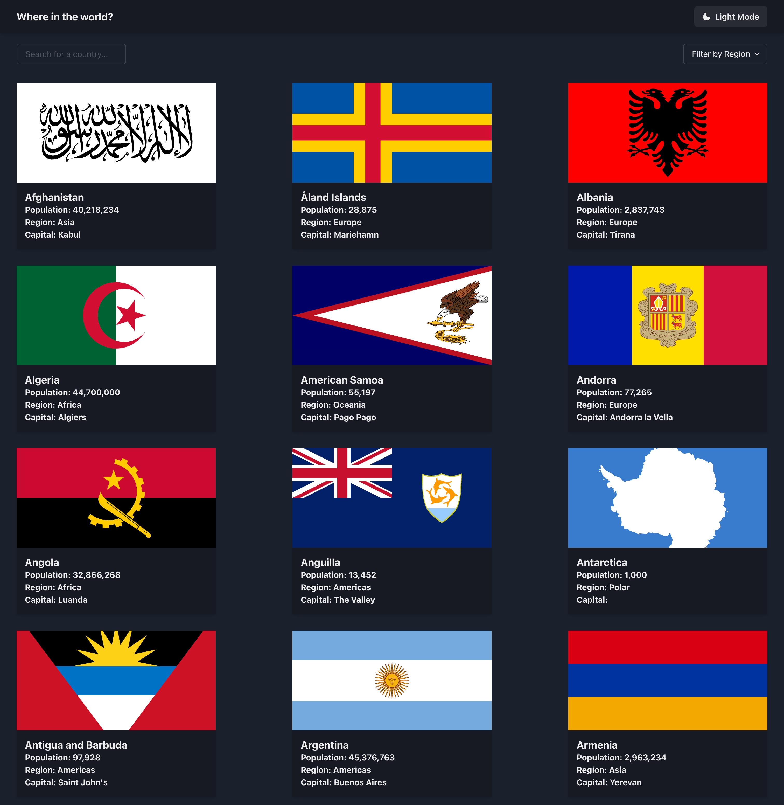

# Frontend Mentor - REST Countries API with color theme switcher solution

This is a solution to the [REST Countries API with color theme switcher challenge on Frontend Mentor](https://www.frontendmentor.io/challenges/rest-countries-api-with-color-theme-switcher-5cacc469fec04111f7b848ca). Frontend Mentor challenges help you improve your coding skills by building realistic projects. 

## Table of contents

- [Overview](#overview)
  - [The challenge](#the-challenge)
  - [Screenshot](#screenshot)
  - [Links](#links)
- [My process](#my-process)
  - [Built with](#built-with)
- [Author](#author)

## Overview

### The challenge

Users should be able to:

- See all countries from the API on the homepage
- Search for a country using an `input` field
- Filter countries by region
- Click on a country to see more detailed information on a separate page
- Click through to the border countries on the detail page
- Toggle the color scheme between light and dark mode *(optional)*

### Screenshot

### Links

- Solution URL: [GitHub](https://github.com/berkeli/cyf-react-challenges/tree/london-class-8/berkeli-halmyradov/challenge-countries)
- Live Site URL: [Netlify Hosted](https://cyf-berkeli-countries.netlify.com)

## My process

### Built with

- React
- TypeScript
- Flexbox
- CSS Grid
- Infinity Scroll
- Mobile-first workflow
- [React](https://reactjs.org/) - JS library
- [Chakra UI](https://chakra-ui.com/) - React Component Library

## Author

- GitHub - [@berkeli](https://www.github.com/berkeli)
- Frontend Mentor - [@berkeli](https://www.frontendmentor.io/profile/berkeli)
- LinkedIn - [@berkeli](https://www.linkedin.com/in/berkeli)
